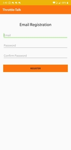
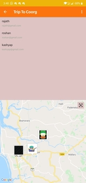
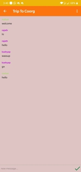
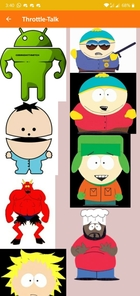

**Throttle Talk**

 The thought of developing this project came from vlog videos from YouTube. Bikers love to go on a ride to high altitude places where there will be no cellular network. This project helps bikers to share their location and status among each other
 
 
 We have firebase as our backend which takes care of authentication and storing chats and live location of users.
 
 we wrote a background thread to constantly update and retrieve user location so that it stays updated during rides
 
 We used google map api to display user location in real time
 
 
 We built a chatroom using firebase firestore for users to interact during their ride
 
 
   Registration page  
  
  userlist along with live user location  
  
  
 chatroom to interact with other users 
 
 we also made an avatar page where we associated each avatar to a number so that  when a user picks an avatar we store that number in database and map it with the image when the image displays in the map
  
 
